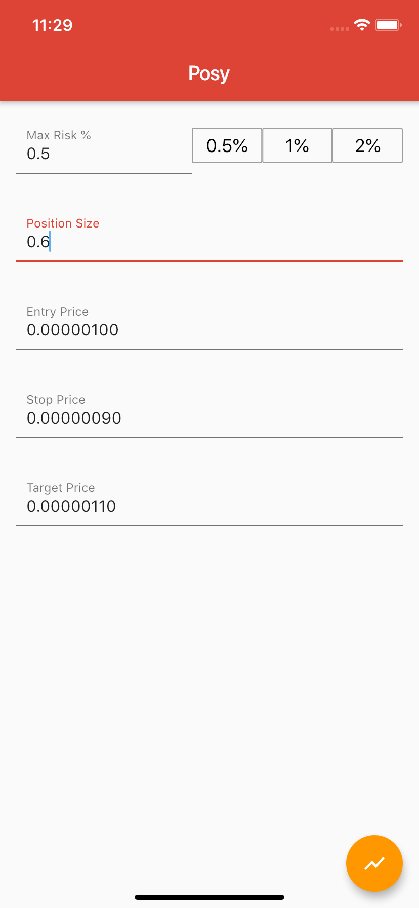
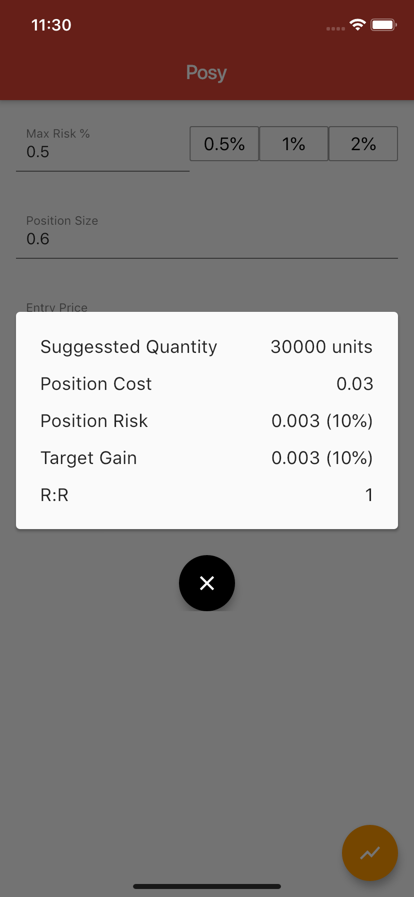

# flutter_posy

A simple position size calculator optimized for crypto currencies, built using BLoC pattern

  <table><tr>
   <td style="text-align: center">
    
  </td>
  <td style="text-align: center">
    
  </td>
 
</tr></table>
